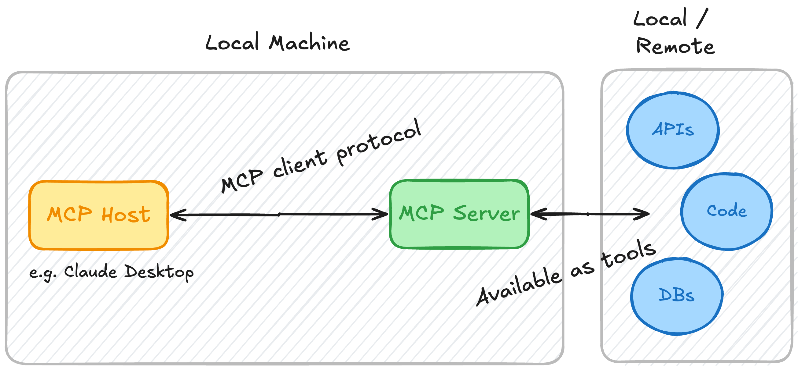

# Python MCP Server - Documentation Search



This is a simple MCP (Minimal Command Protocol) server that allows users to search for documentation from popular
libraries such as **LangChain**, **LlamaIndex**, and **OpenAI** using the **Serper API**. The server fetches search
results and extracts the relevant documentation from the web using HTTP requests and BeautifulSoup.

## Features

- Supports searching documentation for **LangChain**, **LlamaIndex**, and **OpenAI**.
- Uses **Serper API** to perform web searches.
- Extracts and returns the text from the relevant documentation pages.
- Can be used interactively through MCP protocol.

## Requirements

- Python 3.12 or higher.
- **Serper API Key** for performing web searches.
- **MCP library** for the server and tool execution.
- **BeautifulSoup4** and **httpx** for HTTP requests and HTML parsing.

## Installation

### Step 1: Install Python Dependencies

To set up the project, clone this repository and install the required dependencies.

```bash
git clone <repository-url>
cd <repository-directory>
pip install -r requirements.txt
``` 

Or, if you're not using a requirements.txt file:

```bash
pip install httpx beautifulsoup4 mcp python-dotenv
 ```

### Step 2: Set Up Environment Variables

Create a .env file in the root directory of the project with your Serper API Key.

```bash
SERPER_API_KEY=your-serper-api-key-here
```

Make sure the .env file is loaded using the dotenv package.

### Step 3: Run the Server

Once the environment is set up, run the server using the following command:

```bash
uv run main.py
```

The server will start and wait for input.

## Usage

Once the server is running, you can use it to query the latest documentation for specific libraries. Here’s an example
of how to query the tool:

### Example Query

Start your server with ```uv run main.py```.

In another terminal or from within an interactive MCP client, invoke the get_docs tool to search for documentation:

```bash
 get_docs("Chroma DB", "langchain")
```

This will search for "Chroma DB" in the LangChain documentation and return the relevant content.

### Available Libraries

- LangChain: Documentation at langchain.com
- LlamaIndex: Documentation at llamaindex.ai
- OpenAI: Documentation at platform.openai.com

## Code Overview

```main.py```

- FastMCP: Initializes the MCP server.
- Tools: The server has two tools:
- dummy_tool: A simple tool that confirms the server is up and running.
- get_docs: Fetches the latest documentation for a given query and library (LangChain, LlamaIndex, OpenAI).
- search_web(): Handles searching using the Serper API.
- fetch_url(): Fetches a URL and extracts the text content using BeautifulSoup.

```dotenv``` and ```logging```

- Loads the Serper API Key from the ```.env``` file.
- Provides debug-level logging for better visibility into server actions and potential issues.`````

## Troubleshooting

- Missing API Key: Make sure the Serper API Key is set correctly in the ```.env``` file. You’ll get an error if it's
  missing.
- Timeout Issues: If a search or URL fetch times out, try increasing the timeout values or checking the network
  connectivity.
- Package Installation Issues: Ensure all dependencies are installed and the correct Python environment is activated.

## Contributor

Udayan Sawant

